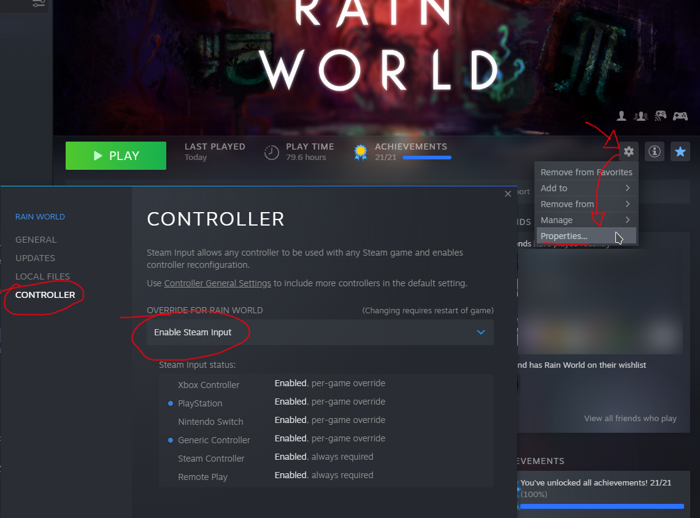
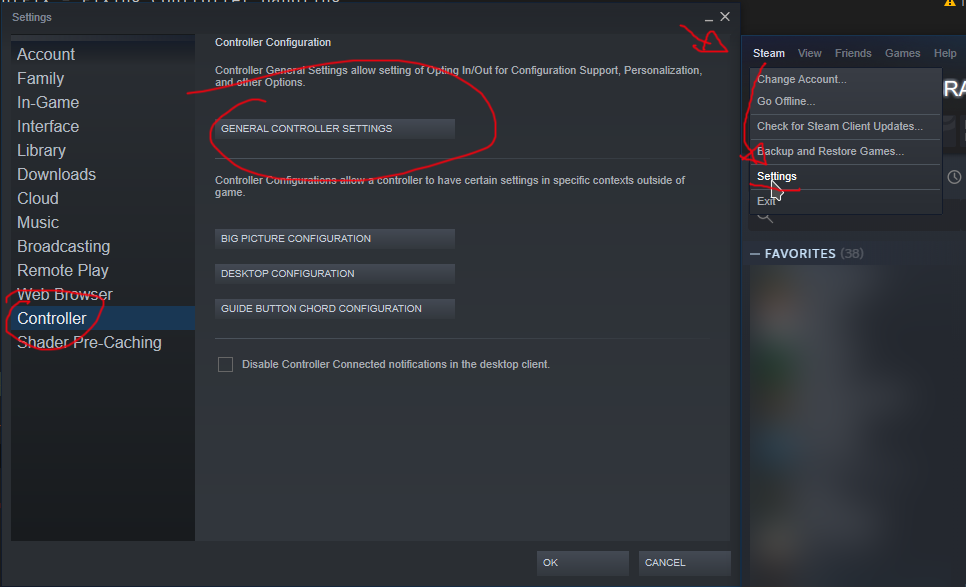
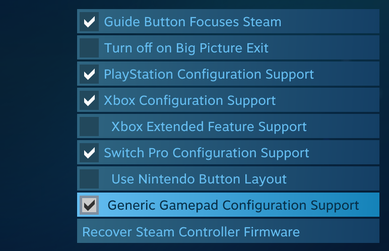

# InputFix - Fixing Controller Handling
*By PJB*

This mod replaces the game's controller handling so it should work better with Steam Input.
This means controller handling won't be broken when playing over things like **Steam Remote Play**.

Other features:
* Trigger are treated as buttons, so you can bind them.
* Show better button names in the options menu.
* Can be fully toggled with a checkbox in the options.

## Installation

1. Make sure you have BepInEx/a mod manager for it installed.
2. Download the mod from [HERE](https://github.com/PJB3005/RainWorldMods/releases/download/inputfix-0.3.0/InputFix.dll).
3. Install the mod in your mod manager.
4. **Make sure Steam Input is enabled, see below.**

## Steam Input

The idea behind this mod is that we give full control to **Steam** (via its XInput API emulation) for game controller handling. This means that Steam's controller handling has to be enabled **fully** for Rain World, or else all InputFix will do is break your controllers. See the following image for how to enable Steam Input for Rain World:

**NOTE** that if you don't launch Rain World from the Steam Client directly, **this will not work**. You will have to enable Steam Input globally for all controller types you care about, in Steam's settings. The mod will inform you with red text in the game's input settings if it's not running from Steam to remind you to set this up.

And then...

No, I can't have the mod "just know" whether steam input is configured correctly, sorry.

## Technical stuff

Steam emulates XInput when Steam Input is enabled. Something about this causes Unity's non-XInput handling code to just break, and the result is broken controller handling in various scenarios.

The mod works by hooking a few Unity functions, namely `Input.GetKey(KeyCode)`, `Input.GetAxisRaw(string)`, `Input.anyKey` and `Input.GetJoystickNames()`. It replaces all the gamepad related behavior with my own, that directly access XInput. Input's polled once per frame with `XInputGetState()`. Really nothing more to it.

No Rain World code (like `RWInput`) has been hooked outside of stuff like the options menu, so this should probably be compatible with everything (like ManyMoreFixes' dpad slide fix).

