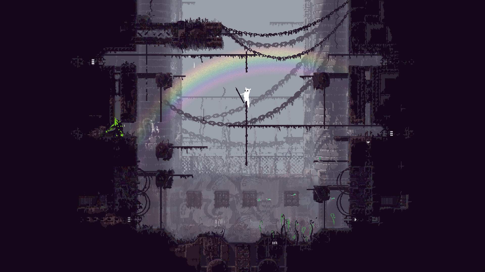

# Sharpener - Less Blurry Rain World
*By PJB*

This mod adds two new scaling modes to the game, making it look nice and crisp instead of a blurry haze.

The mod has three modes:
1. "game default" which is the original game.
2. "sharper" which is the recommended mode. Purely a better upscaler.
3. "native resolution" which renders the game directly at max resolution, but can cause various artifacts and distortions.

## Installation

1. [Have BepInEx and BOI installed](https://www.raindb.net/tutorials.html)
2. Download the mod from **[HERE](todo)**.
3. Install the mod in BOI.
4. (optional) install [ConfigMachine](https://drive.google.com/file/d/1NIE8conaoI1OOHevi4K9tvOG4v-NIfYf/view) to change settings like resolution easily.
5. Go play the game and get eaten by a lizard or something.

## Comparison shot

(all taken at 1080p, open them in fullscreen or something and switch between them)

Original game:

Sharper mode:

Native resolution mode:

## Technical details for other modders

Sharpener hooks Unity's `Screen` class to report a different resolution to the main game, so that we can control Unity's resolution and such while making the game think it's still running at 768p. I also mess with Futile's camera so that we can render the game into a `RenderTexture` for upscaling.

Operation is different in the three modes:
1. Default: we pass through the game's resolution request to Unity so the mod is effectively disabled.
2. Sharper (main mode with the mod): the game renders to an off-screen `RenderTexture` that is the exact size the game wants. Meanwhile Unity is running at user-specified fullscreen/window size. The game is upscaled byto 2x its size with nearest-neighbor, then we downscale that to the final view with bilinear filtering. This works surprisingly well for how simple it is.
3. Native: we just keep the game rendering to the backbuffer but set the resolution higher. It works.

Also `Input.mousePosition` is hooked to scale mouse position.

### Shaders

#### Sharper Mode

Shaders need to be adjusted to be compatible with Sharpener, please read if your mod has any.

Unity wants to render to a `RenderTexture` with an inverted Y projection, and it's safe to say none of the original game's shaders were written with this in mind. *Most* of the game's shaders correctly use Unity's `ComputeScreenPos()` which takes this Y flip into account, but then derive grab texture position from that instead of using `ComputeGrabScreenPos()` which *is* incorrect. Furthermore, many shaders modify screen positions to do stuff like shadow casting, and this *too* is done in a way that would be tons of error-prone effort to make work consistently in both Y directions (this latter part won't create immediately obvious visual bugs like incorrect layering, but does mean stuff like incorrectly-offset shadows that is hard to spot and fix).

Because of this, **all shaders that use `ComputeScreenPos()` (the vast majority of them) must be adjusted to be compatible with Sharpener**, to force positive-Y projection. If your mod adds such a shader, it will have to be adjusted. Luckily the change is *really* simple *and* compatible with a game that isn't using Sharpener, so it should be no problem to include it with your mod.

The only change you have to make is to `#include "_ShaderFix.cginc"` after `UnityCG.cginc`, which can be found in this repo.

Also if you're wondering, the mod forces a positive-Y projection matrix on `OnPreRender()` on the camera. This can't fix the fact that Unity still sets a projection parameter uniform I can't override, so that's why the shaders need changing.

#### Native Resolution Mode

Screen distortion effects like the (rot13'd spoiler) *tenivgl trarengbef va svir crooyrf* manually floor pixel coordinates when sampling the old screen's grab texture. This *works* but does cause an undesirable pixelation effect for these shaders. The mod sets a global `_realRenderScreenSize` shader vector that has the real size, but using this isn't compatible with games not using Sharpener. Not sure if there's a way to fix your mods here in a compatible way. It's not a severe visual bug though so oh well.

#### Modified base game shaders

This repo contains a patch file to the original game shader files that make them compatible with Sharpener, for reference.
